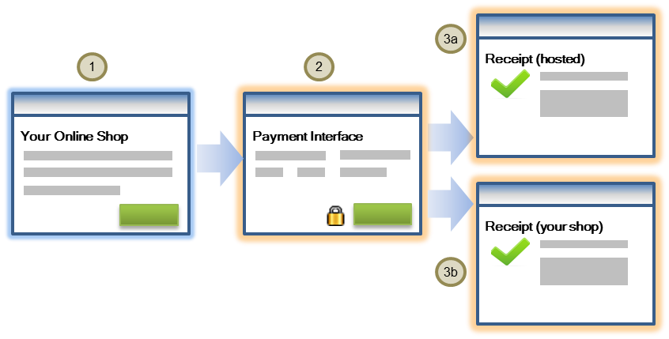

# How to Integrate your web app with the National Bank of Malawi Payment Gateway.

#### Date : 2023-11-24

Author : [Moses Msukwa](https://github.com/mozesi)

In this article, I will demonstrate how you can integrate your website with the __National Bank of Malawi (NBM) payment gateway__ using the hosted checkout model. The hosted checkout allows a business to collect payments from a customer through an interaction hosted and displayed by the payment Gateway.

Below is an illustration of the information flow of the hosted checkout session.
  

 

1. The payer initiates the payment process for goods and services at your shop site.

1. The payer enters the required information, and clicks "Pay".

1. If the payment is successful, the payer can obtain the payment details from one of these sources: the Payment Gateway-hosted receipt or your shop site.

For simplicity, we will simulate a simple case where a payer wants to pay a merchant. For this, We will need two pages. The first page will be an interface to allow a payer to enter the amount to be paid and the currency for the payment. The second page will handle the actual request of the checkout session upon which the payer will be presented with the payment interface from the gateway.

## 1. Create a folder and the files for the project.

In your web server, create a directory and name it __NBAPI__. We will need two files for this use case. We will need an __index.php__ file that will provide an interface to allow a user to enter the desired amount they want to pay.

In the second file __requestSession.php__, we will request the checkout session and make the actual payment. In the __NBAPI__ directory, create the two files namely __index.php__ and __requestSession.php__.

## 2. Create a form for making a payment.

In __index.php__, create a form with two input fields. An input field of the type number for inputing the payable amount and a select field for choosing the desired currency. Below is the code.

```php
<html lang="en">
  <head>
    <meta charset="utf-8">
    <meta name="viewport" content="width=device-width, initial-scale=1">
    <title>payment</title>
    <link rel="canonical" href="https://getbootstrap.com/docs/5.1/examples/navbar-fixed/">
 <link href="https://cdn.jsdelivr.net/npm/bootstrap@5.1.0/dist/css/bootstrap.min.css" rel="stylesheet" integrity="sha384-KyZXEAg3QhqLMpG8r+8fhAXLRk2vvoC2f3B09zVXn8CA5QIVfZOJ3BCsw2P0p/We" crossorigin="anonymous">
<meta name="theme-color" content="#7952b3">
    <link href="navbar-top-fixed.css" rel="stylesheet">
  </head>
  <body>
<nav class="navbar navbar-expand-md fixed-top"  style="background-color:#1e3d11;">
  <div class="container-fluid">
    <a class="navbar-brand" href="index.php" style="color:white">Donate</a>
    <button class="navbar-toggler" type="button" data-bs-toggle="collapse" data-bs-target="#navbarCollapse" aria-controls="navbarCollapse" aria-expanded="false" aria-label="Toggle navigation">
      <span class="navbar-toggler-icon"></span>
    </button>
    <div class="collapse navbar-collapse" id="navbarCollapse">
      <ul class="navbar-nav me-auto mb-2 mb-md-0">
        <li class="nav-item">
          <a class="nav-link active" aria-current="page" href="index.php" style="color:white"><b>Pay</b></a>
        </li>
      </ul>
    </div>
  </div>
</nav>
   <br>
   <main class="container">
  <div class="bg-light p-5 rounded">                      
        <form class="col-md-4" action="requestSession.php" method="POST">
            <div  class="row mb-3">
                <label for="currency" class="form-label">Select Currency</label><br>
                    <select type="text" id="curreny" class="form-select" name="currency"required>
                        <option value="USD">USD</option>
                        <option selected value="MWK">MWK</option>
                    </select>
            </div>
            <div  class="row mb-4">
	            <label for="amount" class="form-label">Enter Amount</label><br>
                    <input type="number" class="form-control" id="amount" name="amount"  min="5" required>
            </div>             
            <div class="col-12">
			    <button class="btn btn-lg btn-primary" type="submit" role="button">Donate Now &raquo;</button>
            </div>
        </form>
  </div>
</main>
    <script src="https://cdn.jsdelivr.net/npm/bootstrap@5.1.0/dist/js/bootstrap.bundle.min.js" integrity="sha384-U1DAWAznBHeqEIlVSCgzq+c9gqGAJn5c/t99JyeKa9xxaYpSvHU5awsuZVVFIhvj" crossorigin="anonymous"></script>
</html>
```
## 3. The result and success indicators

We need to retrieve the result indicator and success indicators. The result indicator will automatically be returned by the gateway via the __return URL__ which we will define in __step 5__. Upon requesting the checkout session, the gateway will return the success indicator which we will store through a session variable. (Note that this can be stored in your system database.)

```php
<?php
session_start();
$resultIndicator  = $_GET["resultIndicator"];
$successIndicator = $_SESSION["successIndicator"];
?>
```
A match of the __$successIndicator__ and the __$resultIndicator__ indicates that the payment was successful.

```php
<?php
       if(isset($resultIndicator)& isset($successIndicator))
       {
          if($resultIndicator == $successIndicator){
              echo "The payment was succesfull";           
      }    
?>

```
## Requesting the hosted checkout interaction

In __requestSession.php__ we need to request the checkout session using the Create Checkout Session operation. The request should include the payment, interaction data and the completion instructions.

## 4. Define and initiate the payment and interaction data.

```php
<?php
session_start();
if( $_POST["currency"] || $_POST["amount"] ) {   
$amount = $_POST['amount'];
$currency = $_POST['currency'];
$reference = uniqid();
$orderId   = uniqid();
$apiUsername ="apiUsername";
$merchant ="MerchatId";
```
## 5. Define the interaction.returnUrl.

As pre-empted in __step 3__, the gateway will need the __$returnUrl__ to redirect the payer after the checkout session. Possibly, when redirected the payer can be  presented with the payment status or any desired message including a receipt.

```php
$returnUrl = "https://returnurl.com";
```
## 6. Your API Password

You should generate the API password in the Merchant Administration Portal. Administrator login credentials are provided to you by NBM when you are successfully on boarded on the gateway as a merchant. As an administrator, you will need to create a new operator with permissions to generate the API password.

```php
$apiPassword ="yourMerchantPortalGeneratedApiPassword";
```
## 7.  The base url for requesting the checkout session.

You will be provided with the base url for the test environment for testing purposes. You will then switch to a production base url.

```php
$baseUrl =  "https://nbm.gateway.mastercard.com/api/nvp/version/49";

```
Then we need to Initiate a curl with the Create Checkout Session operation. As ealier indicated, this request should include the payment and the interaction data, plus the completion instructions. we have already defined the needed parameters from __step 4__.

```php
$ch = curl_init();
curl_setopt($ch, CURLOPT_URL,$baseUrl);
curl_setopt($ch, CURLOPT_RETURNTRANSFER,1);
curl_setopt($ch, CURLOPT_POST,1);
curl_setopt($ch, CURLOPT_POSTFIELDS,
"apiOperation=".$apiOperation."&apiPassword=".$apiPassword."&transaction.reference=".$reference."&interaction.returnUrl=".$returnUrl."&apiUsername=".$apiUsername."&merchant=".$merchant."&order.id=".$orderId."&order.amount=".$amount."&order.currency=".$currency);
$headers = array();
$headers[] = 'Content-Type: application/x-www-form-urlencoded';
curl_setopt($ch, CURLOPT_HTTPHEADER, $headers);
$result = curl_exec($ch);
if(curl_errno($ch)){
	echo 'ERROR:'.curl_error($ch);
}
curl_close($ch);
```

## 7. Extracting the session.id and the success indicator from the curl result.

A successful response in __step 7__ will contain the session.id and the success Indicator parameters.
the result indicator and success indicators

```php
$sessionid = explode("=",explode("&",$result)[2])[1];
$successIndicator = explode("=",explode("&",$result)[5])[1];
```

You may be wondering why the success Indicator.

The gateway sends the result of the payment in a __resultIndicator__ parameter, via the return url (interaction.returnUrl) used to return the payer to your desired page. You can determine the success of the payment by comparing the values of __resultIndicator__ and the __successIndicator__.

A match of the __successIndicator__ and the __resultIndicator__ shows that the payment was successful. Depending on you system use case, you can then save the value returned in the successIndicator parameter on your system to verify the success or failure of the payment. 

Here We will use sessions just to demonstrate the point as explained.

```php
$_SESSION["successIndicator"] = $successIndicator;
$_SESSION["amount"] = $amount ;
$_SESSION["currency"] = $currency;

```
Include the below code for the page structure and the payment request form.

```php
<!doctype html>
<html lang="en">
  <head>
    <meta charset="utf-8">
    <meta name="viewport" content="width=device-width, initial-scale=1">
    <meta name="description" content="">
    <title>your name</title>
    <link rel="canonical" href="https://getbootstrap.com/docs/5.1/examples/navbar-fixed/">
	<link href="https://cdn.jsdelivr.net/npm/bootstrap@5.1.0/dist/css/bootstrap.min.css" rel="stylesheet" integrity="sha384-KyZXEAg3QhqLMpG8r+8fhAXLRk2vvoC2f3B09zVXn8CA5QIVfZOJ3BCsw2P0p/We" crossorigin="anonymous">
    <link href="navbar-top-fixed.css" rel="stylesheet">
  </head>
  <body>
	<nav class="navbar navbar-expand-md fixed-top"  style="background-color:#1e3d11;">
	  <div class="container-fluid">
		<a class="navbar-brand" href="#" style="color:white">Your site</a>
		<button class="navbar-toggler" type="button" data-bs-toggle="collapse" data-bs-target="#navbarCollapse" aria-controls="navbarCollapse" aria-expanded="false" aria-label="Toggle navigation">
		  <span class="navbar-toggler-icon"></span>
		</button>
		<div class="collapse navbar-collapse" id="navbarCollapse">
		  <ul class="navbar-nav me-auto mb-2 mb-md-0">
			<li class="nav-item">
			  <a class="nav-link active" aria-current="page" href="#" style="color:white"><b>Your site</b></a>
			</li>
		  </ul>
		</div>
	  </div>
	</nav>
   <br>
   <main class="container">
  <div class="bg-light p-5 rounded">
    <p class="lead">Make your payment.</p>
	<div class="form-group">
			<div class="col-xs-8">
			<label for="amount">Confirm a payment of <?php echo $currency.$amount;?>. </label>
			<br>
            <br>

			<input type="button" maxlength="5" maxheight="2" class="btn btn-primary btn-lg" value="Pay" onclick="Checkout.showPaymentPage();" />
			</div>
			</div>
	</div>
</main>
```

We then need to reference the __checkout.js__ file from the gateway servers. This will place the Checkout object into global scope. In this case we will use __version 49__ of the checkout.

```php
 <script src="https://maxcdn.bootstrapcdn.com/bootstrap/3.4.1/js/bootstrap.min.js"></script> 
 <script src="https://nbm.gateway.mastercard.com/checkout/version/49/checkout.js" data-error="errorCallback" data-cancel="cancelCallback"></script>
```
We need some JavaScript to finalize the process. we need a call to the Checkout.configure() function and then pass in a JSON object that includes the returned session.id and other payment request parameters to pass in the necessary data for the payment.

```php
        <script type="text/javascript">
            function errorCallback(error) {
                  console.log(JSON.stringify(error));
            }
            function cancelCallback() {
                  console.log('Payment cancelled');
            }
            Checkout.configure({
                merchant: 'MECHARNTID',
                order: {
                    id: '<?php echo $orderId;  ?>' ,
                    amount: '<?php echo $amount;  ?>' ,
                    currency: '<?php echo $currency;  ?>',
                    description: 'description',
                },
				session:{
					id:'<?php echo $sessionid; ?>'
				},
                 interaction:{
                    merchant: {
                        name: 'NAME ',
                        address: {
                            line1: 'YOUR ADDRESS',
                            line2: 'YOUR POST BOX'            
                        }    
                    }
                  }
            });
        </script>   
 <script src="https://cdn.jsdelivr.net/npm/bootstrap@5.1.0/dist/js/bootstrap.bundle.min.js" integrity="sha384-U1DAWAznBHeqEIlVSCgzq+c9gqGAJn5c/t99JyeKa9xxaYpSvHU5awsuZVVFIhvj" crossorigin="anonymous"></script>
</html>
```
There we go! we have the simple integration to the payment gateway.

You can get more details on how to access the payment API from [National Bank of Malawi ](https://www.natbank.co.mw/) and  more information on the API [here](https://test-nbm.mtf.gateway.mastercard.com/api/documentation/integrationGuidelines/index.html?locale=en_US).